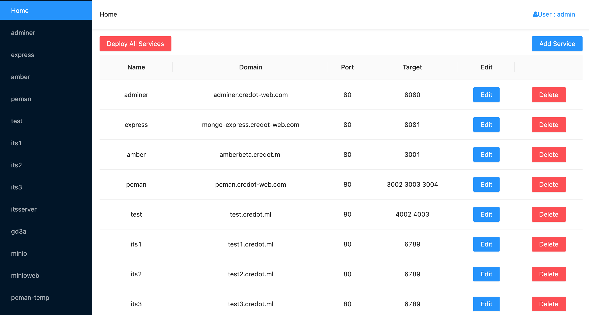
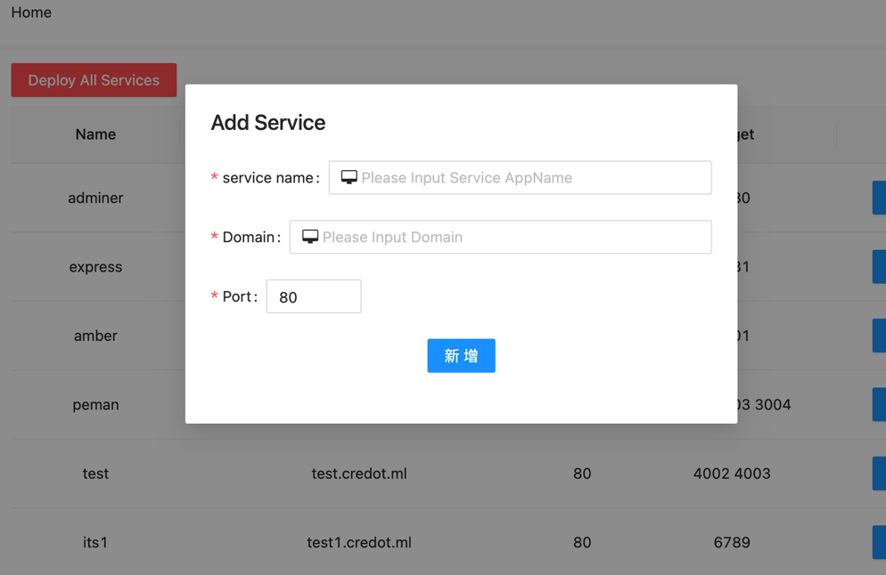

# caddyweb

> Web UI for [caddy](https://caddyserver.com/)

## Manage reverse proxy setting

- homepage



- Add new service

> Every service has own domain and port



- Set handler


### .env

```env
NEXTAUTH_URL=http://localhost:3000 # domain
NEXTAUTH_USER=admin                # user
NEXTAUTH_PASSWORD=123456           # password

DATABASE_URL= #mongoDB url

PORT=3000 # should be same as yarn start port
```

### unrelease

- use query caddy config instead mongoDB
- cloudflare api setting
